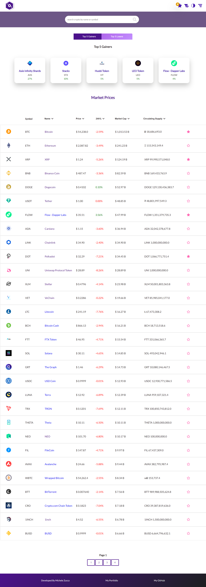

# Crypto Lite

Crypto Lite displays real market data from CryptoCompare's APIs: it features market and historical data, a cryptocurrency converter, a watchlist cart where to add your favorite crypto, cryptocurrency wallets data, and exchanges, together with live news and a theme switch.

# Table of contents:

- [Tech Stack Used](#tech-stack-used)
- [Home](#home)
- [Market Prices](#market-prices)
- [Historical Data](#historical-data)
- [Exchanges](#exchanges)
- [Wallets](#wallets)
- [News](#news)
- [Watchlist](#watchlist)
- [Currency Converter](#currency-converter)
- [Theme Switch](#theme-switch)
- [Deployment](#deployment)

# Tech Stack Used
- TypeScript
- React Js
- Redux
- Redux-thunk
- Redux-saga
- Context API
- DevExtreme React Charts
- Sass

## Home

The home page displays a section of most pages, like market prices, exchanges, wallets and news. The hero section has a dark theme switched with Context API.

## Market Prices

In this page users can view market prices and price changes for the top 100 cryptocurrencies based on the CryptoCompare API. The page displays the top 5 gainers and top 5 losers updated in real time based on percentage change per day. The market prices table has a table head where the user can sort crypto based on price, percentage change, market cap and circulating supply. Each crypto displayed has an add to watchlist button to allow the user to add selected currencies to a watchlist. By clicking on each coin, users can view more details for each cryptocurrency.

## Historical Data

Historical data shows daily pairs and daily exchange volume data for currencies based on user inputs. The charts and tables are based on updated daily data from the CryptoCompare API.

## Exchanges

This page displays a list of available exchanges that users can sort by name, volume, country, grade, gradepoints and rating. Grades vary from A to E and grade points from 0 to 100. By clicking on View Details, users can view more detailed data for each exchange.

## Wallets

## News

## Watchlist

## Currency Converter

## Theme Switch

## Deployment
The app is deployed on Netlify and the demo can be found at the following link: https://crypto-lite-tracker.netlify.app/

