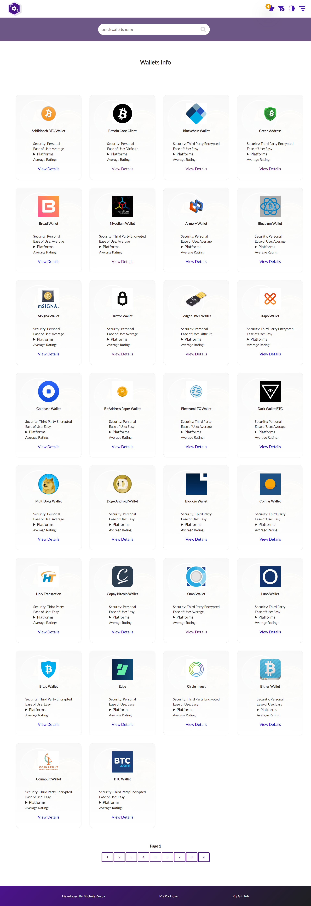
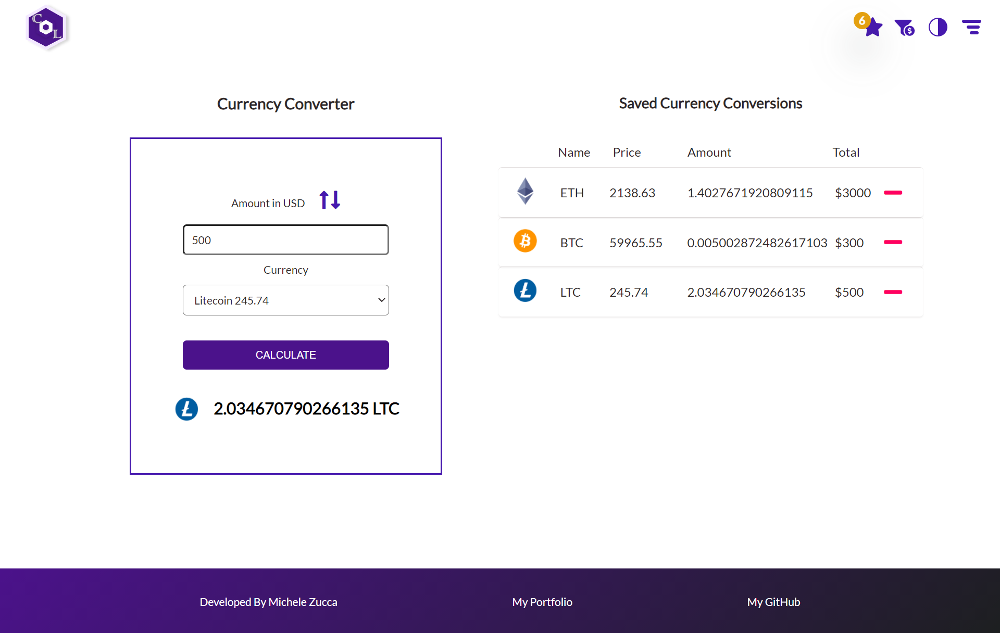

# Crypto Lite

Crypto Lite displays real market data from CryptoCompare's APIs: it features market and historical data, a cryptocurrency converter, a watchlist cart where to add your favorite crypto, cryptocurrency wallets data, and exchanges, together with live news and a theme switch.

# Table of contents:

- [Tech Stack Used](#tech-stack-used)
- [Home](#home)
- [Market Prices](#market-prices)
- [Historical Data](#historical-data)
- [Exchanges](#exchanges)
- [Wallets](#wallets)
- [News](#news)
- [Watchlist](#watchlist)
- [Currency Converter](#currency-converter)
- [Theme Switch](#theme-switch)
- [Deployment](#deployment)

# Tech Stack Used
- TypeScript
- React Js
- Redux
- Redux-thunk
- Redux-saga
- Context API
- DevExtreme React Charts
- Sass

## Home

## Market Prices

## Historical Data

## Exchanges

## Wallets

## News

## Watchlist

## Currency Converter

## Theme Switch

## Deployment
The app is deployed on Netlify and the demo can be found at the following link: https://crypto-lite-tracker.netlify.app/

