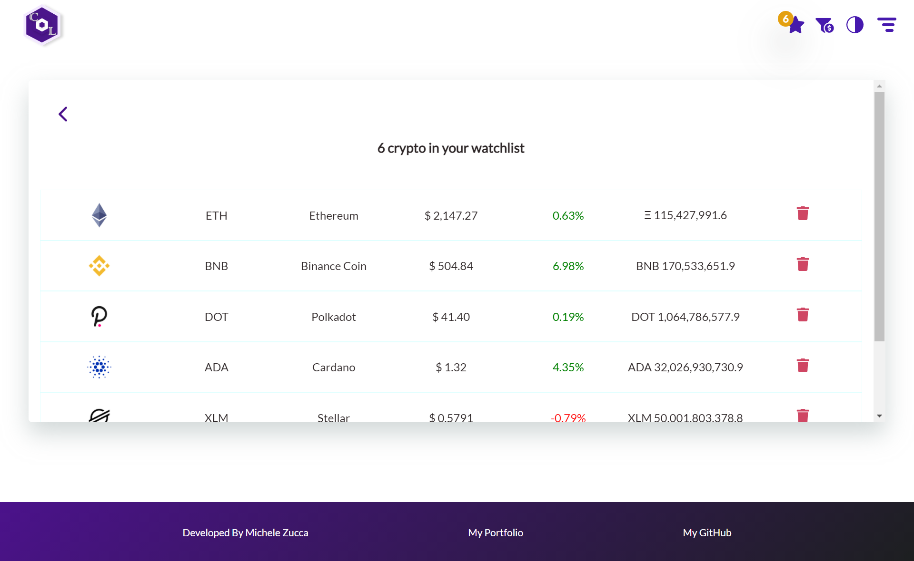

# Crypto Lite

Crypto Lite displays real market data from CryptoCompare's APIs: it features market and historical data, a cryptocurrency converter, a watchlist cart where to add your favorite crypto, cryptocurrency wallets data, and exchanges, together with live news and a theme switch.

# Table of contents:

- [Tech Stack Used](#tech-stack-used)
- [Home](#home)
- [Market Prices](#market-prices)
- [Historical Data](#historical-data)
- [Exchanges](#exchanges)
- [Wallets](#wallets)
- [News](#news)
- [Watchlist](#watchlist)
- [Currency Converter](#currency-converter)
- [Theme Switch](#theme-switch)
- [Improvements](#improvements)

- [Deployment](#deployment)

# Tech Stack Used
- TypeScript
- React Js
- Redux
- Redux-thunk
- Redux-saga
- Context API
- DevExtreme React Charts
- Local Storage
- Sass

## Home

The home page displays a section of most pages, like market prices, exchanges, wallets and news. The hero section has a dark theme switched with Context API.

## Market Prices

In this page users can view market prices and price changes for the top 100 cryptocurrencies based on the CryptoCompare API. The page displays the top 5 gainers and top 5 losers updated in real time based on percentage change per day. The market prices table has a table head where the user can sort crypto based on price, percentage change, market cap and circulating supply. Each crypto displayed has an add to watchlist button to allow the user to add selected currencies to a watchlist. By clicking on each coin, users can view more details for each cryptocurrency.

By clicking on each currency, users can view more details regarding a certain crypto, like proof of type, hash rate, rating, open price, high, low, including weekly, monthly, 6 months, and all time charts for price and volume.

## Historical Data

Historical data shows daily pairs and daily exchange volume data for currencies based on user inputs. The charts and tables are based on updated data from the CryptoCompare API.

## Exchanges

This page displays a list of available exchanges that users can sort by name, volume, country, grade, gradepoints and rating. Grades vary from A to E and grade points from 0 to 100. By clicking on View Details, users can view more detailed data for each exchange.

## Wallets

Here are displayed around 250 wallets with data collected from the wallet’s API. Users can view data per wallet such as ease of use, platforms for which the wallet is available, coins, security and anonymity.

## News

News for cryptocurrencies are another feature brought by the CryptoCompare APIs. This page displays 50 news items divided in 5 pages and updated in real time from the API. Each news article, when clicked, redirects to its original publisher, as a way to generate more clicks for that particular crypto website.

## Watchlist

In this watchlist cart are displayed all the cryptocurrencies added to the watchlist, which the user can remove. If there are no currencies on the watchlist, this page is not clickable.

## Currency Converter

With the currency converter, users can convert a selected amount of USDT into crypto and vice versa. After converting into currency, the conversion can be saved on a table displayed on the right, that the user can always access or from which the saved conversion can be later deleted.

## Theme Switch

The whole application uses a theme switch functionality created with Context API. The app theme can be switched from light mode to dark mode.

## Deployment

The app is deployed on Netlify and the demo can be found at the following link: https://crypto-lite-tracker.netlify.app/

## Improvements
The app has some improvements to be made
- Convert epoch time values in charts to timestamp values
- Improve responsivness
- CryptoCompare only provides data such as price, market cap, current supply, percentage change for the top 100 cryptocurrencies. In the future, I will work with different crypto APIs in order to provide more market data about all cryptocurrencies.  

